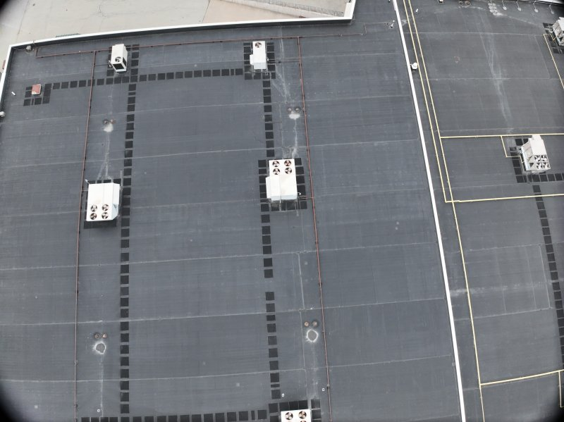
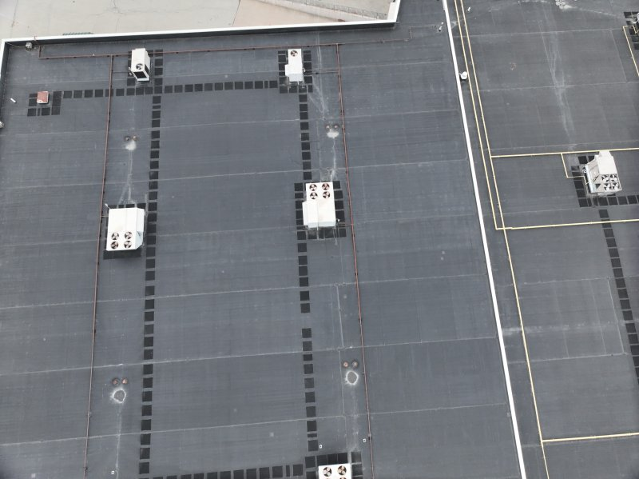

<div align="center">

# Camera Dewarp

**Fast, GPU-accelerated lens distortion correction for DJI drone images**

[](LICENSE)
[](https://www.rust-lang.org/)

<br>

[](https://github.com/MAvitia/Camera_Dewarp/releases/latest)

</div>

---

<br>

## Before & After

<table>
<tr>
<td align="center"><strong>Original (barrel distortion)</strong></td>
<td align="center"><strong>Dewarped</strong></td>
</tr>
<tr>
<td></td>
<td></td>
</tr>
</table>

> Notice the curved edges and bent rooflines in the original. After dewarping, all straight lines are geometrically correct — critical for photogrammetry and mapping accuracy.

<br>

## What It Does

Camera Dewarp reads the **factory lens calibration** embedded in every DJI drone image's XMP metadata (`DewarpData`) and applies geometric undistortion to remove barrel distortion. No manual calibration, no checkerboard patterns — just point it at your mission folder and go.

<br>

## Features

<table>
<tr>
<td width="50%">

- **Zero-config** — calibration is read automatically from each image's XMP metadata
- **Batch processing** — process entire mission folders with thousands of images
- **Native GUI** — folder pickers, live before/after preview, progress bar

</td>
<td width="50%">

- **21 images/sec** — parallel processing across all CPU cores via rayon
- **GPU acceleration** — optional wgpu compute shader for the remap step
- **Single portable binary** — no Python, no runtime, no installer

</td>
</tr>
</table>

<br>

## Quick Start

### GUI

Download [`camera-dewarp.exe`](https://github.com/MAvitia/Camera_Dewarp/releases/latest) and double-click — no installation needed.

1. Click **Browse** to select your mission image folder
2. Set an output folder (or leave blank for auto)
3. Click **Dewarp Batch**

### CLI

```bash
# Batch dewarp a mission folder
camera-dewarp -r ./mission_photos -o ./dewarped

# Show embedded calibration data
camera-dewarp --info -r ./mission_photos

# Single image
camera-dewarp photo.jpg -o ./out

# GPU-accelerated
camera-dewarp -r ./photos -o ./out --gpu
```

<br>

## CLI Reference

| Flag | Description |
|------|-------------|
| `-o, --output` | Output folder (default: `<input>_dewarped`) |
| `-q, --quality` | JPEG quality 1–100 (default: 95) |
| `-r, --recursive` | Process subfolders |
| `--alpha` | Crop control: `0` = no black edges, `1` = keep all pixels |
| `--gpu` | Use GPU compute shader for remap |
| `--info` | Print calibration info and exit |
| `--gui` | Launch GUI (default if no input given) |

<br>

## How It Works

1. **XMP Parsing** — reads the first 64 KB of each JPEG to extract DJI's `DewarpData`: Brown-Conrady distortion coefficients (k1, k2, k3, p1, p2) and camera intrinsics (fx, fy, cx, cy)

2. **LUT Construction** — builds a remap lookup table once per batch; for each output pixel, the forward distortion model computes where to sample in the distorted source

3. **Parallel Remap** — images are decoded, remapped with bilinear interpolation, and re-encoded in parallel across all CPU cores; the GPU path dispatches the remap as a wgpu compute shader

4. **Crop Optimization** — equivalent of OpenCV's `getOptimalNewCameraMatrix` finds the maximal valid region, eliminating black borders

<br>

## Supported Cameras

Any DJI drone that embeds `DewarpData` in XMP metadata:

| Series | Examples |
|--------|----------|
| Mini | Mini 2, Mini 3, Mini 3 Pro, Mini 4 Pro |
| Air | Air 2, Air 2S, Air 3 |
| Mavic | Mavic 3, Mavic 3 Pro, Mavic 3 Enterprise |
| Matrice | M300 RTK, M350 RTK (with Zenmuse cameras) |
| Phantom | Phantom 4 RTK, Phantom 4 Pro V2 |

Images must have `DewarpFlag: 0` (not already dewarped by DJI's on-device processing).

<br>

## Performance

Benchmarked on AMD Ryzen 9 7950X (16C/32T), 3,940 images at 5280×3956 px:

| | Speed | 3,940 images |
|---|---|---|
| Python + OpenCV (1 thread) | 2.3 img/s | ~28 min |
| **Camera Dewarp (Rust, 32 threads)** | **21 img/s** | **3 min 7 sec** |

<br>

## Build from Source

Requires [Rust](https://rustup.rs/) 1.80+.

```bash
git clone https://github.com/MAvitia/Camera_Dewarp.git
cd Camera_Dewarp
cargo build --release
```

Binary output: `target/release/camera-dewarp.exe`

<br>

## Project Structure

```
src/
  main.rs          — CLI (clap) + GUI launcher
  calibration.rs   — XMP byte scan, DewarpData parsing
  remap.rs         — Undistort LUT, bilinear remap with rayon
  gpu.rs           — wgpu compute shader pipeline
  pipeline.rs      — Batch processor, parallel workers, progress channel
  gui.rs           — egui application
shaders/
  remap.wgsl       — GPU remap compute shader (WGSL)
samples/
  before.jpg       — Sample: original with barrel distortion
  after.jpg        — Sample: corrected output
```

<br>

## License

This project is licensed under the [MIT License](LICENSE).

<br>

## Author

**Manuel Avitia** — [@MAvitia](https://github.com/MAvitia)

<br>

## Acknowledgments

| Crate | Purpose | License |
|-------|---------|---------|
| [egui](https://github.com/emilk/egui) | Immediate-mode GUI | MIT |
| [rayon](https://github.com/rayon-rs/rayon) | Data parallelism | MIT / Apache-2.0 |
| [wgpu](https://github.com/gfx-rs/wgpu) | GPU compute (Vulkan/DX12) | MIT / Apache-2.0 |
| [image](https://github.com/image-rs/image) | JPEG/PNG encode/decode | MIT / Apache-2.0 |
| [clap](https://github.com/clap-rs/clap) | CLI argument parsing | MIT / Apache-2.0 |
| [rfd](https://github.com/PolyMeilex/rfd) | Native file dialogs | MIT |
| [crossbeam](https://github.com/crossbeam-rs/crossbeam) | Concurrent channels | MIT / Apache-2.0 |
